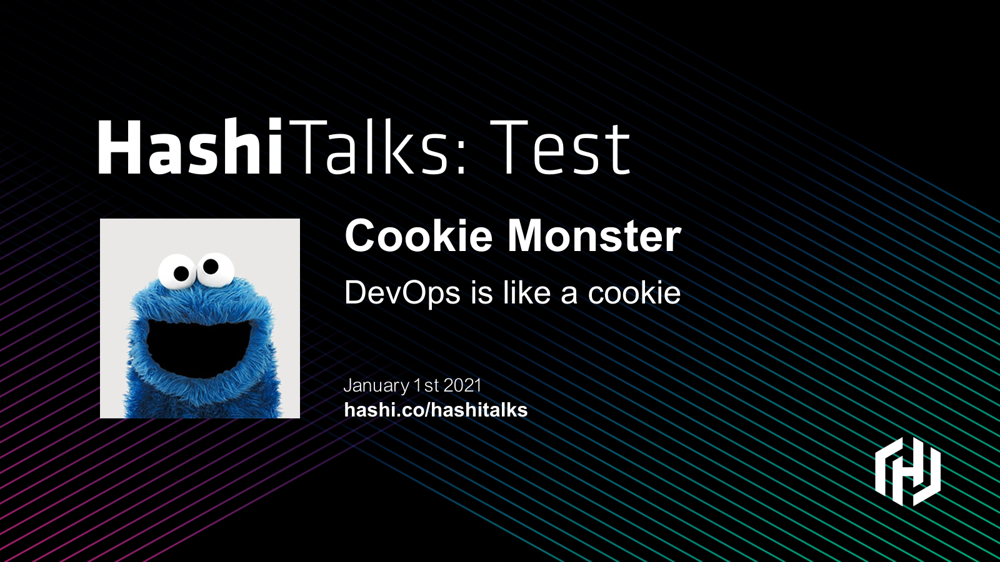

# Picasso templates

This repository holds [picasso](https://github.com/eveld/picasso) templates that
can be used to generate image assets. Picasso is a tool that can take a template
and data, and generate images from them. The templates that Picasso uses are
written in HCL (HashiCorp Configuration Language) and define the input,
output and design of the resulting image.

Some of these templates might require additional assets to be copied
into this repository for them to work. Due to licenses for those
assets, they are not included in this repository.

> Note:  The paths in the templates are computed from the directory
the binary is run in. This means that a template that refers to `images/background.png`
and is executed with the command `picasso generate -t hashitalks/regional/banner.hcl`
will look for the background at `$PWD/images/background.png`.

## Install Picasso

1. Download the binary for your operating system located at
   [Picasso's releases](https://github.com/eveld/picasso/releases).

1. Unzip the binary using your command line.
   ```shell
   $ unzip picasso_${OS}${ARCH}.zip
   ```

1. Copy the `picasso` binary to your `/usr/local/bin`.
   Make sure to change the permissions it is executable.
   ```shell
   $ chmod +x picasso
   $ cp picasso /usr/local/bin
   ```

1. You can verify that you've installed it by running `picasso` in your command line.
   ```shell
   $ picasso

   Picasso generates graphical assets from HCL2 templates
   
   Usage:
     picasso [command]
   
   Available Commands:
     generate    Generates graphical assets from HCL2 templates
     help        Help about any command
   
   Flags:
     -h, --help   help for picasso
   
   Use "picasso [command] --help" for more information about a command.
   ```
## Generate your first assets for a regional HashiTalks

Let's say you want to generate assets for `HashiTalks: Test`. You need the following
images:

- A banner for Marketo (for sending emails)
- Social graphics (Twitter and LinkedIn share cards)

We have some templates created for you. You can use these to generate a banner
and social graphics for your regional HashiTalks.

1. Reach out to the HashiCorp Community team to retrieve the background and
   font assets. They will send you a compressed file named `picasso_assets.zip`.

1. Download this repository.
   ```shell
   $ git clone https://github.com/eveld/picasso-templates.git
   ```

1. Change directory into the repository.
   ```shell
   $ cd picasso-templates
   ```

1. Unzip the `picasso_assets.zip`.

1. Copy the `images/` and `fonts/` folders to this repository.

1. Generate a banner using `picasso`. You need to pass some information.
   Use the template in `hashitalks/regional/banner.hcl` and output
   the image to `banner.png`. You also need to specify the regional edition
   of HashiTalks by setting the `edition` variable. In our example,
   we set `edition="Test"`.
   ```shell
   $ picasso generate \
        -t hashitalks/regional/banner.hcl \
        -o banner.png \
        --var edition="Test"
   ```

1. You should now have a file named `banner.png` with `HashiTalks: Test`.
   

1. You can generate a social media card with a similar command.
   Use the `card.hcl` template, output the image
   to `card.png`, and add a tagline.
   ```shell
   $ picasso generate \
        -t hashitalks/regional/card.hcl \
        -o card.png \
        --var edition="Test" \
        --var tagline="Regional learning"
   ```

1. You should now have a file named `card.png` with `HashiTalks: Test` and the tagline, `Regional learning`.
   

## Generate a speaker card

After you've scheduled speakers for HashiTalks, you can create
speaker cards. These can be used for speakers to promote their talks
over social media and for transition slides.

1. Make sure you have a folder with `fonts/` and background `images/` in
   this repository.

1. Create a comma-separate value file with the edition, speaker, title,
   photo, date, and URL. The example below uses one speaker.
   ```csv
   edition,speaker,title,photo,date,url
   Test,Cookie Monster,DevOps is like a Cookie,images/cookie.jpg,January 1st 2021,hashi.co/hashitalks
   ```

1. Generate a speaker card using `picasso`. You need to pass some information.
   Use the template in `hashitalks/regional/speaker_1line.hcl` and read the CSV
   file with the speaker.
   ```shell
   $ picasso generate \
        -t hashitalks/regional/speaker_1line.hcl \
        --csv example.csv
   ```

1. You should now have a file named `output-<some id>.png` for the speaker.
   For multiple speakers, each file will have a unique ID.
   
